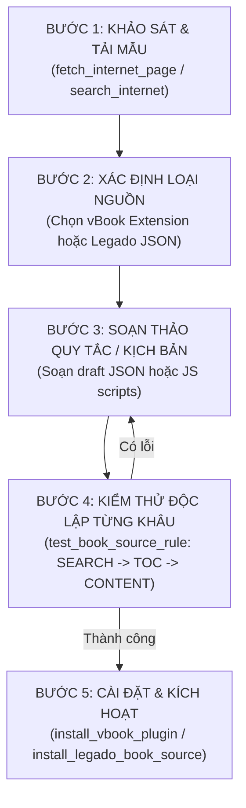

# KỸ NĂNG: BOOK SOURCE ENGINEER (CHUYÊN GIA NGUỒN TRUYỆN LEGADO & VBOOK)

Tài liệu quy chuẩn dành cho Agent và Chatbot để khảo sát, thiết kế, lập trình, kiểm thử độc lập và sửa lỗi nguồn truyện (Book Source) trên nền tảng **Legado** và tiện ích mở rộng **vBook (Darkrai9x)**.

---

## 0. NGUYÊN TẮC BẤT BIẾN (PRIME DIRECTIVES)

1. **Khảo sát trước khi viết mã (Inspect First)**: Không đoán selector hoặc cấu trúc URL. Luôn dùng `fetch_internet_page` hoặc đọc HTML thực tế của trang nguồn để xác định chính xác DOM, API, Headers và phương thức phân trang.
2. **Kiểm thử phân rã từng giai đoạn (Stage-by-Stage Verification)**: Một nguồn hợp lệ phải vượt qua độc lập 4 bài kiểm tra: `SEARCH` (tìm kiếm) -> `DETAIL` (thông tin) -> `TOC` (mục lục) -> `CONTENT` (nội dung chương). Không kết luận nguồn hoạt động khi chưa đọc được nội dung chương sạch.
3. **Phân tách lỗi cài đặt và lỗi xử lý (Isolate Failure Surfaces)**: Lỗi cài đặt (ZIP lỗi, thiếu trường metadata, sai JSON) khác với lỗi lúc chạy (DOM thay đổi, chặn IP, mã hóa JS). Luôn xác định đúng tầng lỗi trước khi chỉnh sửa.
4. **An toàn & Thân thiện với máy chủ nguồn (Politeness & Security)**: Luôn gắn User-Agent hiện đại, cấu hình `concurrentRate` hợp lý để tránh gây nghẽn máy chủ nguồn hoặc bị đưa vào danh sách đen (Blacklist). Không lưu trữ bí mật (API key, token cá nhân) trong nguồn công khai.

---

## 1. ĐẶC TẢ CHUẨN NGUỒN TRUYỆN

### 1.1. Chuẩn vBook Extension (Darkrai9x/vbook-extensions)

Mỗi vBook extension là một tệp lưu trữ ZIP với cấu trúc gốc nghiêm ngặt:

```text
extension.zip/
├── plugin.json       # Tệp mô tả siêu dữ liệu và khai báo ánh xạ tệp kịch bản
├── icon.png          # Biểu tượng của nguồn (bắt buộc kích thước tối thiểu 128x128)
└── src/              # Thư mục chứa các tệp JavaScript xử lý
    ├── config.js     # Hàm dùng chung, URL cơ sở, chuẩn hóa chuỗi
    ├── home.js       # Khai báo các tab trang chủ / bảng xếp hạng / thể loại
    ├── gen.js        # Bóc tách danh sách truyện theo tab/thể loại/phân trang
    ├── search.js     # Bóc tách kết quả tìm kiếm theo từ khóa
    ├── detail.js     # Bóc tách thông tin chi tiết một bộ truyện
    ├── toc.js        # Bóc tách danh sách toàn bộ chương (mục lục)
    └── chap.js       # Bóc tách và làm sạch nội dung văn bản của một chương
```

#### Quy chuẩn `plugin.json`
```json
{
  "metadata": {
    "name": "Tên Nguồn",
    "author": "Tên Tác Giả",
    "version": "1.0.0",
    "source": "https://example.com",
    "regexp": "^(https?://)?(www\\.)?example\\.com",
    "description": "Nguồn đọc truyện chữ ví dụ",
    "locale": "vi_VN",
    "language": "javascript",
    "type": "novel"
  },
  "script": {
    "home": "home.js",
    "detail": "detail.js",
    "toc": "toc.js",
    "chap": "chap.js",
    "search": "search.js"
  }
}
```
*Lưu ý quan trọng:*
- `metadata.language` bắt buộc phải là `"javascript"`.
- `metadata.regexp` dùng để nhận diện liên kết chia sẻ/mở trực tiếp trong ứng dụng.

#### Khung mẫu các tệp JavaScript vBook chuẩn:

- **`src/config.js`**:
  ```javascript
  const BASE_URL = "https://example.com";
  function cleanHtml(html) {
      if (!html) return "";
      return html.replace(/<script[^>]*>([\s\S]*?)<\/script>/gi, "")
                 .replace(/<style[^>]*>([\s\S]*?)<\/style>/gi, "")
                 .trim();
  }
  ```

- **`src/home.js`**:
  ```javascript
  function execute() {
      return Response.success([
          { title: "Mới cập nhật", input: BASE_URL + "/moi-cap-nhat?page=", script: "gen.js" },
          { title: "Xem nhiều", input: BASE_URL + "/hot?page=", script: "gen.js" }
      ]);
  }
  ```

- **`src/gen.js`**:
  ```javascript
  function execute(url, page) {
      page = page || "1";
      let response = Http.get(url + page).html();
      let list = [];
      let items = response.select(".list-stories .story-item");
      items.forEach(el => {
          list.push({
              name: el.select(".title a").text(),
              link: el.select(".title a").attr("href"),
              cover: el.select("img").attr("src"),
              description: el.select(".author").text(),
              host: BASE_URL
          });
      });
      let next = items.size() > 0 ? (parseInt(page) + 1).toString() : null;
      return Response.success(list, next);
  }
  ```

- **`src/detail.js`**:
  ```javascript
  function execute(url) {
      let doc = Http.get(url).html();
      return Response.success({
          name: doc.select("h1.story-title").text(),
          cover: doc.select(".story-cover img").attr("src"),
          author: doc.select(".author-name").text(),
          description: doc.select(".story-summary").html(),
          detail: doc.select(".category-name").text(),
          host: BASE_URL,
          ongoing: !doc.text().includes("Đã hoàn thành")
      });
  }
  ```

- **`src/toc.js`**:
  ```javascript
  function execute(url) {
      let doc = Http.get(url).html();
      let list = [];
      doc.select("#chapter-list a").forEach(el => {
          list.push({
              name: el.text(),
              url: el.attr("href"),
              host: BASE_URL
          });
      });
      return Response.success(list);
  }
  ```

- **`src/chap.js`**:
  ```javascript
  function execute(url) {
      let doc = Http.get(url).html();
      let content = doc.select("#chapter-content");
      content.select("script, style, .ads").remove();
      return Response.success(content.html());
  }
  ```

---

### 1.2. Chuẩn Nguồn Legado (BookSource JSON)

Legado sử dụng định dạng JSON đại diện cho thực thể `BookSource` với các nhóm quy tắc chính:

```json
{
  "bookSourceName": "Tên Nguồn",
  "bookSourceUrl": "https://example.com",
  "bookSourceType": 0,
  "bookUrlPattern": "https?://example\\.com/truyen/.*",
  "concurrentRate": "2000",
  "header": "{\"User-Agent\": \"Mozilla/5.0 (Windows NT 10.0; Win64; x64) AppleWebKit/537.36\"}",
  "searchUrl": "https://example.com/tim-kiem?q={{key}}&page={{page}}",
  "ruleSearch": {
    "bookList": ".story-item",
    "name": "h3.title a@text",
    "author": ".author@text",
    "bookUrl": "h3.title a@href",
    "coverUrl": "img@src",
    "intro": ".summary@text"
  },
  "ruleBookInfo": {
    "name": "h1.title@text",
    "author": ".author a@text",
    "intro": "#synopsis@html",
    "coverUrl": ".cover-img img@src",
    "tocUrl": ""
  },
  "ruleToc": {
    "chapterList": "#chapter-list li a",
    "chapterName": "text",
    "chapterUrl": "href",
    "nextTocUrl": ""
  },
  "ruleContent": {
    "content": "#chapter-content@html",
    "replaceRegex": "##.*Quảng cáo.*|##Theo dõi fanpage.*"
  }
}
```

#### Bảng tra cứu cú pháp Selector Legado:

| Cú pháp | Ví dụ | Ý nghĩa |
| :--- | :--- | :--- |
| **CSS + @attr** | `div.desc@text` hoặc `a@href` | Chọn thuộc tính của phần tử theo CSS selector tiêu chuẩn |
| **XPath** | `//div[@class='intro']/p/text()` | Bóc tách bằng XML/HTML XPath |
| **JSONPath** | `$.data.chapters[*].title` | Dùng khi endpoint trả về dữ liệu API dạng JSON |
| **Rhino JS (`@js:`)** | `@js: result.replace(/Chương \d+:/, '').trim()` | Thực thi mã JavaScript nhúng để biến đổi chuỗi |
| **Regex (`##`)** | `##<p>.*quảng cáo.*<\/p>##` | Thay thế chuỗi bằng biểu thức chính quy (cắt rác nội dung) |
| **Biến nội suy** | `{{key}}`, `{{page}}`, `{{baseUrl}}` | Tham số động khi gọi Search/Explore URL |

---

## 2. QUY TRÌNH 5 BƯỚC TẠO NGUỒN MỚI



### Bước 1: Khảo sát thực địa website
1. Lấy URL trang chủ, một trang tìm kiếm mẫu, một trang chi tiết truyện, và một chương đọc thực tế.
2. Dùng công cụ `fetch_internet_page(url)` để xem mã HTML thực tế trả về.
3. Kiểm tra xem trang có dùng Ajax tải mục lục riêng không (kiểm tra các thẻ script, thẻ `data-id`, hoặc API request trong Network tab).
4. Kiểm tra mã hóa (Cloudflare, mã hóa font/canvas, anti-copy).

### Bước 2: Thiết kế quy tắc bóc tách
- **Nếu làm nguồn Legado**:
  - Xác định URL tìm kiếm: GET hay POST. Nếu là POST: `url,{"method":"POST","body":"key={{key}}"}`.
  - Viết selector cho `ruleSearch`, `ruleBookInfo`, `ruleToc`, `ruleContent`.
- **Nếu làm nguồn vBook**:
  - Chuẩn bị đầy đủ: `plugin.json`, `config.js`, `home.js`, `gen.js`, `search.js`, `detail.js`, `toc.js`, `chap.js`.

### Bước 3: Đóng gói bản nháp (Draft Creation)
- **Tạo Legado Draft**:
  Gọi công cụ `create_legado_book_source_draft`:
  ```json
  {
    "sourceJson": "{\"bookSourceName\":\"...\",\"bookSourceUrl\":\"...\", ...}"
  }
  ```
- **Tạo vBook Draft**:
  Gọi công cụ `create_vbook_plugin_draft`:
  ```json
  {
    "name": "Tên Tiện Ích",
    "source": "https://example.com",
    "author": "AI Agent",
    "type": "novel",
    "version": "1.0.0",
    "files": {
      "config.js": "...",
      "home.js": "...",
      "detail.js": "...",
      "toc.js": "...",
      "chap.js": "..."
    }
  }
  ```

### Bước 4: Kiểm thử nghiêm ngặt
Dùng `test_book_source_rule` để xác nhận trên môi trường thực tế:
1. `testType = "SEARCH"`, `keyword = "ma"`: Kiểm tra số lượng kết quả và link truyện.
2. `testType = "TOC"`, `targetUrl = "<link truyện mẫu>"`: Kiểm tra số lượng chương và định dạng tên chương.
3. `testType = "CONTENT"`, `targetUrl = "<link chương mẫu>"`: Kiểm tra văn bản chương có sạch sẽ, đủ đoạn văn, không sót mã quảng cáo.

### Bước 5: Cài đặt và Bàn giao
- Gọi `install_legado_book_source` hoặc `install_vbook_plugin` với cờ `enableAfterInstall = true` khi người dùng yêu cầu kích hoạt ngay.

---

## 3. CẨM NANG CHẨN ĐOÁN & SỬA LỖI NGUỒN (TROUBLESHOOTING MATRIX)

Khi một nguồn gặp trục trặc, áp dụng bảng chẩn đoán có hệ thống sau:

### Lỗi 1: Cloudflare 403 / Chặn Bot / "Just a moment..."
- **Hiện tượng**: `fetch_internet_page` hoặc `test_book_source_rule` trả về HTTP 403, 503 hoặc trang chứa "Checking your browser".
- **Biện pháp xử lý**:
  1. Thêm `header` trong BookSource: gắn `User-Agent` của trình duyệt Chrome Desktop hiện đại.
  2. Bật `enabledCookieJar = true` để lưu trữ cookie phiên làm việc.
  3. Cài đặt `concurrentRate` về `3000` hoặc `5000` (giảm tần suất gọi).
  4. Nếu nguồn dùng Cloudflare Turnstile/Challenge: Sử dụng thuộc tính `loginUrl` hoặc nạp qua WebView nội bộ của ứng dụng.

### Lỗi 2: Mục lục trống (TOC Empty) hoặc chỉ lấy được trang 1
- **Hiện tượng**: `TOC` trả về 0 chương hoặc chỉ có 20/1000 chương.
- **Biện pháp xử lý**:
  1. *Trường hợp Ajax TOC*: Trang truyện không nhúng danh sách chương trong HTML tĩnh mà gọi API (ví dụ: `/api/chapters?bookId=123`).
     -> Chuyển `ruleBookInfo.tocUrl` hoặc trong vBook gọi thẳng API URL đó trong `toc.js`.
  2. *Trường hợp Mục lục phân trang*:
     - Legado: Điền selector thẻ trang sau vào `ruleToc.nextTocUrl` (ví dụ: `a.next-page@href`).
     - vBook: Sử dụng vòng lặp tải hoặc đệ quy phân trang trong `toc.js` để hợp nhất toàn bộ chương trước khi `Response.success(list)`.

### Lỗi 3: Nội dung chương trống (Content Empty) hoặc dính mã rác/watermark
- **Hiện tượng**: Trình đọc hiển thị trắng tinh hoặc chứa các dòng cảnh báo bản quyền/quảng cáo cá độ.
- **Biện pháp xử lý**:
  1. *Kiểm tra selector*: Website thường đổi ID từ `#content` sang `.reading-content` hoặc `.chapter-c`. Cập nhật lại selector chính xác.
  2. *Loại bỏ rác bằng replaceRegex (Legado)*:
     ```text
     ##(?i)(đọc truyện tại|truyện được dịch bởi|chúc bạn đọc truyện vui vẻ).*|##<div class="ads".*?<\/div>
     ```
  3. *Làm sạch trong vBook (`chap.js`)*:
     ```javascript
     doc.select(".ads, .watermark, script, style").remove();
     return Response.success(doc.select("#chapter-content").html());
     ```

### Lỗi 4: Thứ tự chương bị đảo ngược (Chương mới nhất lên đầu)
- **Hiện tượng**: Chương 1000 nằm ở vị trí đầu tiên, chương 1 nằm ở cuối cùng.
- **Biện pháp xử lý**:
  - Legado: Thêm quy tắc đảo thứ tự trong `ruleToc.chapterList`: sử dụng `@js: result.reverse()`.
  - vBook: Trong `toc.js`, gọi `list.reverse()` trước khi trả về kết quả.

---

## 4. BẢN ĐỒ TÍCH HỢP CÔNG CỤ (TOOL INTEGRATION MAP)

Dưới đây là danh sách các công cụ mà Agent/Chatbot gọi trực tiếp khi thực hiện kỹ năng này:

| Tên Công Cụ (Tool Name) | Tham Số Cần Thiết (Key Args) | Mục Đích Sử Dụng |
| :--- | :--- | :--- |
| `fetch_internet_page` | `url`, `headers` | Đọc mã nguồn HTML thô của trang đích để phân tích DOM |
| `diagnose_book_source` | `sourceUrl` hoặc `sourceName`, `profile` | Chẩn đoán toàn diện sức khỏe nguồn Legado có sẵn |
| `repair_book_source` | `sourceUrl`, các trường quy tắc cần sửa | Chỉnh sửa và cập nhật ngay lập tức nguồn Legado bị lỗi |
| `test_book_source_rule` | `sourceJson`/`sourceUrl`, `testType`, `keyword`, `targetUrl` | Kiểm tra độc lập quy tắc SEARCH, TOC, hoặc CONTENT |
| `create_legado_book_source_draft` | `sourceJson` | Tạo bản nháp nguồn Legado mới trong bộ nhớ cache |
| `install_legado_book_source` | `draftId` hoặc `sourceJson`, `overwrite`, `enableAfterInstall` | Cài đặt chính thức nguồn Legado vào Room Database |
| `create_vbook_plugin_draft` | `name`, `source`, `files` (map file JS) | Tạo cấu trúc bản nháp extension vBook |
| `install_vbook_plugin` | `draftId`, `enableAfterInstall` | Đóng gói ZIP và cài đặt extension vBook vào app |

---

## 5. BẢNG KIỂM TRA CHẤT LƯỢNG (QUALITY CHECKLIST TRƯỚC KHI BÀN GIAO)

- [ ] URL gốc (`bookSourceUrl` / `source`) có thể truy cập ổn định.
- [ ] Regex nhận diện (`bookUrlPattern` / `regexp`) bắt chính xác URL truyện, không xung đột với nguồn khác.
- [ ] Tìm kiếm (`SEARCH`) trả về ít nhất 1 kết quả với đầy đủ Tên, Tác giả, và Ảnh bìa.
- [ ] Mục lục (`TOC`) liệt kê đúng thứ tự chương từ 1 đến hết, tên chương sạch sẽ.
- [ ] Nội dung (`CONTENT`) không bị cắt cụt, bảo toàn định dạng đoạn văn `<p>`, sạch quảng cáo.
- [ ] Không có lỗi cú pháp JavaScript hoặc JSON làm crash luồng phân tích.
