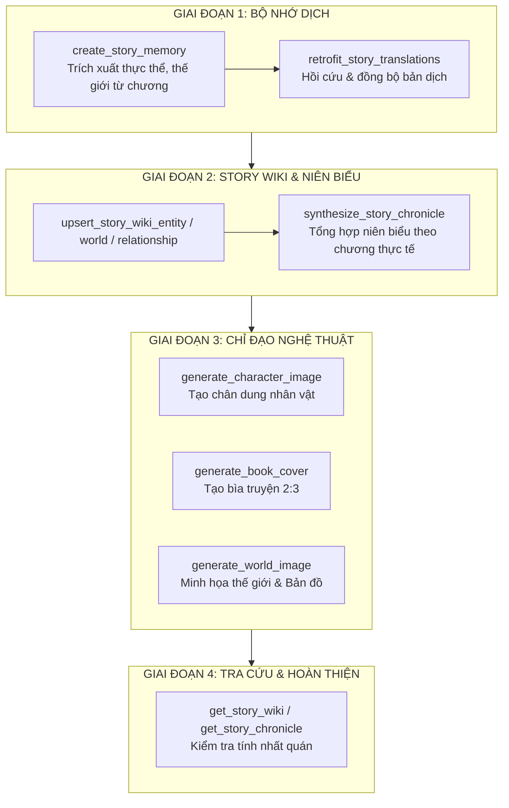

# KỸ NĂNG: STORY WIKI & ART DIRECTOR (CHUYÊN GIA BỘ NHỚ DỊCH & CHỈ ĐẠO NGHỆ THUẬT)

Kỹ năng chuyên sâu dành cho Agent và Chatbot nhằm quản trị vòng đời tri thức tác phẩm: từ trích xuất bộ nhớ dịch (Story Memory), biên tập bách khoa toàn thư tiểu thuyết (Story Wiki), xây dựng niên biểu đại sự ký theo diễn tiến chương thực tế, cho đến chỉ đạo nghệ thuật tạo chân dung nhân vật, minh họa thế giới và bìa truyện.

---

## 0. NGUYÊN TẮC CỐT LÕI (PRIME DIRECTIVES)

1. **Tuyệt đối bám sát văn bản gốc (Fact Grounding)**: Mọi thông tin nhân vật, cảnh giới, vũ khí, thế lực phải xuất phát từ văn bản chương truyện hoặc tóm tắt được xác minh. Không tự ý bịa đặt quan hệ, tông môn hay chiến tích chưa từng xuất hiện.
2. **Niên biểu đại sự ký phi tuyến tính & Đúng số chương thực tế**:
   - Khi viết niên biểu (Chronicle / Timeline), **bắt buộc** phải ghi đúng số chương thực tế (`chapterIndex`, ví dụ: *Chương 1 - Chương 45* hoặc *Chương 120 - Chương 168*).
   - Hiển thị **bản dịch tiếng Việt của tiêu đề chương**, tuyệt đối không để nguyên văn thô (raw) tiếng Trung.
   - Tổng hợp sự kiện thành các thời kỳ / đại sự ký theo biến cố logic của cốt truyện (ví dụ: *Thời kỳ Luyện Khí Kỳ - Đại chiến Hắc Phong Lĩnh*), **không** liệt kê số thứ tự cứng nhắc 1, 2, 3, 4 một cách vô nghĩa.
3. **Chuẩn hóa cặp thuật ngữ Raw ↔ Bản dịch**:
   - Luôn duy trì trường `raw` (từ gốc Hán/Trung) và `target` (bản dịch chuẩn tiếng Việt).
   - Sử dụng phiên âm Hán Việt chuẩn xác cho nhân danh và địa danh.
4. **Chỉ đạo nghệ thuật không chữ rác (Clean Art Generation)**:
   - Khi tạo ảnh nhân vật (`generate_character_image`) hoặc bìa truyện (`generate_book_cover`), ảnh kết xuất phải là concept art kỹ thuật số thuần túy.
   - Tuyệt đối nghiêm cấm việc nhúng chữ viết, watermark, logo, tiêu đề text vào trong bức ảnh.

---

## 1. ĐẶC TẢ CẤU TRÚC BỘ NHỚ DỊCH & STORY WIKI

### 1.1. Cấu trúc Thực thể (Entities)
- `raw`: Tên gốc (ví dụ: `苏晓`).
- `target`: Tên dịch chuẩn (ví dụ: `Tô Hiểu`).
- `type`: Phân loại gồm `character` (nhân vật), `faction` (thế lực/tông môn), `location` (địa danh), `technique` (công pháp/kỹ năng), `artifact` (pháp bảo/trang bị).
- `gender`: Giới tính (`nam`, `nữ`, `không xác định`).
- `rank`: Cảnh giới, chức vị, cấp bậc (ví dụ: `Thợ Săn Diệt Pháp cấp 1`).
- `aliases`: Danh sách danh hiệu, biệt danh (ví dụ: `Bạch Dạ`, `Kẻ Săn Đêm`).
- `description`: Hồ sơ tóm tắt ngoại hình, tính cách, đặc điểm nổi bật.

### 1.2. Thiết lập thế giới (World Building)
- `raw`: Thuật ngữ gốc (ví dụ: `轮回乐园`).
- `target`: Dịch nghĩa chuẩn (ví dụ: `Luân Hồi Nhạc Viên`).
- `category`: Thể loại gồm `cultivation_realm` (cảnh giới), `weapon` (vũ khí), `technique` (kỹ năng), `faction` (thế lực), `location` (địa điểm), `item` (vật phẩm), `system` (hệ thống/quy tắc), `concept` (khái niệm).
- `description`: Diễn giải chi tiết công dụng, quy luật vận hành hoặc bối cảnh.
- `entityRefs`: Danh sách các thực thể liên quan mật thiết.

### 1.3. Mối quan hệ (Relationships)
- `source`: Tên nhân vật/thế lực A.
- `target`: Tên nhân vật/thế lực B.
- `relationship`: Loại hình quan hệ (ví dụ: `sư đồ`, `huynh đệ`, `kẻ thù sinh tử`, `chủ tớ`, `đồng minh`).
- `description`: Bối cảnh phát sinh mối quan hệ hoặc ân oán cụ thể.

### 1.4. Niên biểu đại sự ký (Story Chronicle Eras)
- `eraTitle`: Tiêu đề thời kỳ (ví dụ: *Quyển 1: Tân thủ thí luyện - Diệt Pháp quật khởi*).
- `chapterRange`: Dải chương thực tế (ví dụ: *Chương 1 - Chương 45*).
- `eraSummary`: Bối cảnh và diễn biến chủ đạo trong giai đoạn này.
- `milestoneEvents`: Mảng các cột mốc trọng đại diễn ra trong giai đoạn.
- `keyCharacters`: Các nhân vật cốt lõi tham gia hoặc chịu tác động.

---

## 2. QUY TRÌNH 4 GIAI ĐOẠN TRIỂN KHAI

### Giai đoạn 1: Xây dựng & Hoàn thiện Bộ nhớ dịch
1. Khi dịch một chương mới hoặc phân tích sách, gọi `create_story_memory(bookUrl, chapterIndex)` để tự động trích xuất các danh từ riêng mới.
2. Nếu phát hiện thuật ngữ dịch chưa tối ưu, cập nhật lại `target` và gọi `retrofit_story_translations(bookUrl)` để quét và cập nhật lại toàn bộ văn bản các chương đã dịch từ trước.

### Giai đoạn 2: Biên tập Story Wiki & Đại sự ký
1. Thêm hoặc cập nhật hồ sơ chi tiết các nhân vật then chốt qua `upsert_story_wiki_entity`.
2. Bổ sung các thiết lập cảnh giới, thần khí, môn phái qua `upsert_story_wiki_world`.
3. Kết nối mạng lưới quan hệ xã hội qua `upsert_story_wiki_relationship`.
4. Tổng hợp đại sự ký: gọi `synthesize_story_chronicle(bookUrl, startChapter, endChapter)` để gom nhóm diễn biến thành các kỷ nguyên logic, ghi rõ số chương và tiêu đề chương tiếng Việt.

### Giai đoạn 3: Chỉ đạo Nghệ thuật & Tạo hình ảnh
1. **Tạo chân dung nhân vật**:
   - Gọi `generate_character_image(bookUrl, entityRaw)`.
   - Engine sẽ tự động trích xuất ngoại hình, trang phục, khí chất từ verified facts trong Story Memory để tạo prompt tạo ảnh concept art 1024x1024.
2. **Tạo bìa truyện (Book Cover)**:
   - Trước khi tạo bìa: Bắt buộc phải có tên Truyện đã dịch tiếng Việt (lấy theo tên người dùng đã sửa trong app, hoặc tự xác nhận rõ ràng với người dùng khi được yêu cầu qua chatbot) và tên tác giả.
   - Gọi `generate_book_cover(bookUrl, title, author, prompt)`:
     - `title`: Tên truyện đã dịch tiếng Việt chuẩn (trình bày nổi bật, nghệ thuật trên bìa).
     - `author`: Tên tác giả (trình bày trang nhã ở phần dưới hoặc bên cạnh).
     - `prompt`: Phong cách nghệ thuật, ánh sáng, chi tiết nhân vật trung tâm hoặc bối cảnh.
   - Kết xuất bìa khổ dọc tỉ lệ vàng 2:3 (1024x1536), phong cách cinematic fantasy/fiction, tự động cập nhật làm bìa chính thức trên kệ sách của người đọc.
3. **Tạo minh họa thế giới & Bản đồ**:
   - Gọi `generate_world_image(bookUrl, raw="__story_world_map__", category="world_map")` để vẽ bản đồ thế giới khổ ngang 1536x1024.
   - Gọi `generate_world_image(bookUrl, raw="...", category="weapon")` để vẽ vũ khí, pháp bảo hoặc thánh địa tông môn.

---

## 3. BẢN ĐỒ CÔNG CỤ TƯƠNG TÁC (TOOL MAPPING)

| Tên công cụ | Mục đích nghiệp vụ |
| :--- | :--- |
| `create_story_memory` | Trích xuất AI thực thể, thế giới và sự kiện từ nội dung chương |
| `get_story_memory` | Lấy toàn bộ bộ nhớ dịch của sách |
| `retrofit_story_translations` | Cập nhật đồng bộ các thay đổi thuật ngữ vào toàn bộ chương đã dịch |
| `synthesize_story_chronicle` | Tổng hợp niên biểu đại sự ký theo từng giai đoạn chương thực tế |
| `save_story_chronicle` | Lưu bản ghi một thời kỳ niên biểu cụ thể |
| `upsert_story_wiki_entity` | Thêm/sửa hồ sơ nhân vật, môn phái trong Wiki |
| `delete_story_wiki_entity` | Xóa thực thể khỏi Wiki |
| `upsert_story_wiki_world` | Thêm/sửa thiết lập thế giới, cảnh giới, vũ khí |
| `delete_story_wiki_world` | Xóa thiết lập thế giới |
| `upsert_story_wiki_relationship` | Thêm/sửa mối quan hệ nhân vật, môn phái |
| `delete_story_wiki_relationship` | Xóa mối quan hệ |
| `get_story_wiki` | Tra cứu toàn bộ bách khoa Story Wiki theo tab |
| `generate_character_image` | Tạo ảnh chân dung AI cho nhân vật từ fact trong memory |
| `generate_book_cover` | Tạo ảnh bìa truyện khổ dọc 2:3 có tên truyện đã dịch và tác giả, gán vào kệ sách |
| `generate_world_image` | Tạo ảnh minh họa vũ khí, địa danh hoặc bản đồ thế giới |

---

## 4. CHECKLIST ĐÁNH GIÁ CHẤT LƯỢNG

- [ ] Thuật ngữ dịch thống nhất 100% giữa Story Memory và văn bản đọc.
- [ ] Hồ sơ nhân vật có đầy đủ tên gốc Hán tự, tên dịch chuẩn, giới tính, và mô tả đặc điểm.
- [ ] Niên biểu đại sự ký ghi đúng dải chương thực tế và tiêu đề chương tiếng Việt (không để tiếng Trung thô).
- [ ] Sự kiện niên biểu tóm tắt theo biến cố bước ngoặt, không liệt kê số thứ tự 1, 2, 3 vô nghĩa.
- [ ] Ảnh bìa truyện bắt buộc hiển thị rõ nét tên truyện đã dịch và tên tác giả với bố cục nghệ thuật chuyên nghiệp, không dính chữ rác linh tinh hay watermark.
