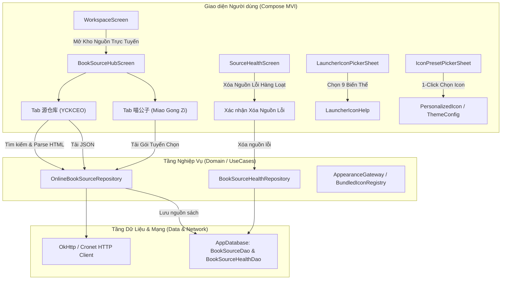

# Plan: Hệ Thống Icon, Xóa Nguồn Lỗi & Kho Nguồn Sách Trực Tuyến Workspace (P47)

Created: 2026-10-02T17:25:00+07:00  
Status: 🟡 Chờ duyệt (Pending Approval)  
Corpus: `drducqy95/DrDucBook` (Legado Material 3 fork)  
Target Device: Huawei Nova HBN-LX9 / Android 14

---

## 1. Tổng Quan Kế Hoạch (Executive Overview)

Kế hoạch Milestone Phase 47 mở rộng toàn diện gồm 3 phân hệ trụ cột theo yêu cầu người dùng:

1. **Phân hệ 1: Nâng cấp Hệ thống Icon Toàn diện (Launcher & In-App Functional Icons)**
   - Nâng cấp biểu tượng ứng dụng DrDucBook trên màn hình chính: xóa bỏ lỗi khung lồng khung (double-border), sửa lỗi monochrome Themed Icons trên Android 13+, tạo 9 phong cách màu sắc sắc sảo, tách biệt độc lập trong `AndroidManifest.xml` & `LauncherIconPickerSheet`.
   - Nâng cấp hệ thống Icon Chức năng Tích hợp: Thư viện `BundledIconRegistry` với hơn 30 vector icon phong phú chuẩn Material 3 Expressive & Artistic; giao diện `IconPresetPickerSheet` cho phép **bấm 1 click là thay thế ngay icon cũ** (ở thanh điều hướng, giá sách, trang cá nhân hóa, thanh công cụ đọc sách, menu đọc) mà không bắt buộc người dùng tự tìm ảnh ngoài máy.
2. **Phân hệ 2: Tính năng Xóa Nguồn Lỗi Hàng Loạt Khi Kiểm Tra Tình Trạng Nguồn (Source Health Bulk Deletion)**
   - Cung cấp nút xóa hàng loạt nguồn lỗi (Batch Delete Error Sources) và chế độ chọn nhiều (Multi-select) trong `SourceHealthScreen`.
   - Hộp thoại xác nhận an toàn hiển thị số lượng nguồn sẽ xóa; tự động dọn dẹp sạch Room DB (`BookSourceDao`, `BookSourceHealthDao`, `CacheDao`) và cập nhật lại dashboard thống kê tức thì.
3. **Phân hệ 3: Trung Tâm Nguồn Sách Trực Tuyến Trong Workspace (Online Book Source Hub)**
   - Phân tích và tích hợp 2 kho nguồn lớn nhất của cộng đồng Legado:
     - **源仓库 (YCKCEO - `yckceo.com`)**: Tra cứu, lọc theo tính năng (Khám phá, Tìm kiếm, Truyện tranh, Sách nói), sắp xếp, phân trang và 1-click tải/nhập trực tiếp JSON nguồn vào CSDL (hỗ trợ nhập đơn lẻ và chọn nhiều nhập hàng loạt).
     - **喵公子 (Miao Gong Zi - `miaogongzi.net`)**: Cung cấp danh mục các Gói Nguồn Sách Tuyển Chọn Tinh Phẩm (XIU2, Nhất Trình, Kho nguồn Nyasama, Tiểu Hàn Manga, Minh Nguyệt, Ổn Định, Nam Phong, Quan Nhĩ, Phá Băng...), hỗ trợ 1-click tải và nhập trọn bộ nguồn sách vào DrDucBook.
   - Bổ sung module `BOOK_SOURCE_HUB` vào danh sách công cụ Workspace, tạo màn hình Compose chuẩn MVI `BookSourceHubScreen` với 2 Tab mượt mà.

---

## 2. Phân Tích Cấu Trúc Chức Năng 2 Web Nguồn Sách

### 2.1. Web 1: [阅读 - 源仓库 (YCKCEO)](https://www.yckceo.com/yuedu/shuyuan/index.html)
- **Bản chất:** Kho nguồn sách cộng đồng Legado với hàng ngàn nguồn được đăng tải và cập nhật hàng ngày.
- **Cấu trúc dữ liệu & Endpoint:**
  - **Danh sách & Tìm kiếm:**  
    `GET https://www.yckceo.com/yuedu/shuyuan/index.html`  
    *Tham số query:*
    - `page`: Số trang (1, 2, 3...)
    - `keys`: Từ khóa tìm kiếm (tên nguồn, domain trang truyện)
    - `order1`: Tiêu chí sắp xếp (`time`: thời gian cập nhật, `down`: lượt tải về)
    - `order2`: Thứ tự (`1`: giảm dần - DESC, `2`: tăng dần - ASC)
    - `ver`: Phiên bản (`""`: tất cả, `3`: Legado 3.x, `2`: Legado 2.x)
    - `faxian`: Tính năng Khám phá (`1`: có, `0`: không)
    - `sousuo`: Tính năng Tìm kiếm (`1`: có, `0`: không)
    - `tu`: Nguồn truyện tranh / hình ảnh (`1`: có, `0`: không)
    - `shengyin`: Nguồn sách nói / audio (`1`: có, `0`: không)
  - **Cấu trúc Card hiển thị (`.ylist`):**
    - `id`: Mã nguồn định danh (vd: `7898`, `7897`...)
    - `name`: Tên nguồn & URL trang gốc (vd: "顶点小说移动版 https://m.yewa.cc")
    - `badges`: Các nhãn tính năng ("3.X", "发", "搜", "图", "声")
    - `author`: Tên tác giả / người đăng
    - `downloads`: Lượt tải về
    - `time`: Thời gian cập nhật ("1 giờ trước", "1 ngày trước"...)
  - **API Xuất / Tải JSON Nguồn Sách:**  
    `GET https://www.yckceo.com/yuedu/shuyuan/jsons?id={id}`  
    *Hỗ trợ tải gộp nhiều nguồn:* `id={id1}-{id2}-{id3}`  
    *Kết quả trả về:* Mảng JSON chuẩn `List<BookSource>` của Legado, có thể parse trực tiếp thành `BookSource` entity và lưu vào Room DB!

### 2.2. Web 2: [阅读书源 (Miao Gong Zi)](https://yuedu.miaogongzi.net/gx.html)
- **Bản chất:** Trang tổng hợp các **Gói Hợp Tập Nguồn Sách Chọn Lọc (Curated Bundles)** uy tín nhất, được cộng đồng kiểm duyệt chất lượng cao.
- **Cấu trúc dữ liệu:**
  - Danh mục các gói nguồn tinh phẩm:
    1. *源仓库书源 (Kho nguồn tuyển chọn)*: `https://shuyuan.nyasama.cc/cdn/5f626361539d546e6fa3a02b24598284.json`
    2. *XIU2精品书源 (Nguồn tinh phẩm XIU2)*: `https://gh.ns114.cc/github.com/XIU2/Yuedu/raw/refs/heads/master/shuyuan`
    3. *一程的书源合集 (Hợp tập Nhất Trình)*: `https://cdn.mgz.la/shuyuan/250701%E6%9C%80%E5%90%8E%E4%B8%80%E7%89%88%E4%B8%80%E7%A8%8B.json`
    4. *漫画源·小寒 (Nguồn manga Tiểu Hàn)*: `https://shuyuan.nyasama.cc/shuyuan/c5dccfb4fea13577819b10e0a3a810ea.json`
    5. *明月照大江书源合集 (Hợp tập Minh Nguyệt Chiếu Đại Giang)*: `https://sy.nyasama.cc/shuyuan/469b68b8c8e7344eb38664d2fb1bdd17.json`
    6. *稳定书源合集 (Hợp tập nguồn ổn định)*: `https://shuyuan-api.yiove.com/import/book-source-collection/eaedccd4-1252-4962-a565-c7a342f95f90`
    7. *楠枫书源合集 (Hợp tập Nam Phong)*: `https://shuyuan.nyasama.cc/shuyuan/f5b15e9641d164937061974cfefb675c.json`
    8. *关耳女频 (Nguồn ngôn tình nữ Quan Nhĩ)*: `https://cdn.mgz.la/shuyuan/guaner25.02.03.txt`
    9. *破冰书源 (Nguồn Phá Băng)*: `https://legado.miaogongzi.org/%E9%98%85%E8%AF%BB%E4%B9%A6%E6%BA%90/sy.json`
    10. *黄凡凡书源 (Nguồn Hoàng Phàm Phàm Coolapk)*: `https://legado.miaogongzi.org/%E9%98%85%E8%AF%BB%E4%B9%A6%E6%BA%90/hff.json`
    11. *不世玄奇搜索引擎书源 (Nguồn máy chủ tìm kiếm)*: `https://cdn.miaogongzi.cc/shuyuan/%E6%90%9C%E7%B4%A2%E5%BC%95%E6%93%8E%E9%80%9A%E7%94%A8.json`
  - Cơ chế nạp: Tải file JSON/TXT qua HTTP, parse danh sách `BookSource` và lưu vào DB.

---

## 3. Kiến Trúc Kỹ Thuật (Architecture & Data Flow)

---

## 4. Các Giai Đoạn Triển Khai (Phases Roadmap)

| Phase | Tên Phase | Nội dung cốt lõi | Trạng thái |
|---|---|---|---|
| **01** | `phase-01-app-icons-upgrade` | Launcher icons 9 biến thể + Xóa lỗi lồng khung + Android 13+ Themed Icons + `BundledIconRegistry` + `IconPresetPickerSheet` 1-click thay thế | ⬜ Chờ duyệt |
| **02** | `phase-02-source-health-bulk-delete` | Thêm tính năng Xóa nguồn lỗi hàng loạt (Batch Delete Error Sources) + Multi-select trong `SourceHealthScreen` + Dọn dẹp DB | ⬜ Chờ duyệt |
| **03** | `phase-03-online-book-source-data-layer` | Xây dựng Data Models, Parser HTML cho YCKCEO, fetcher JSON `jsons?id=...`, và fetcher gói nguồn Miao Gong Zi kèm cache offline | ⬜ Chờ duyệt |
| **04** | `phase-04-workspace-book-source-hub-ui` | Thêm module `BOOK_SOURCE_HUB` vào Workspace + Màn hình Compose MVI `BookSourceHubScreen` với 2 Tab (YCKCEO & Miao Gong Zi) + 1-Click Import | ⬜ Chờ duyệt |
| **05** | `phase-05-verification-build-and-deploy` | Chạy BrandIdentityTest, kiểm thử đơn vị, compile Kotlin, build APK và cài đặt trực tiếp lên điện thoại Huawei xác thực toàn bộ | ⬜ Chờ duyệt |

---

## 5. Chi Tiết Từng Giai Đoạn (Detailed Phase Breakdown)

### Phase 01: Nâng Cấp Toàn Diện Hệ Thống Icon App
- **Launcher Icons:**
  - Thiết kế vector gốc `ic_launcher_fg_core.xml` chuẩn tỷ lệ an toàn (Safe-zone 66dp/72dp), loại bỏ khung squircle có sẵn trong PNG cũ.
  - Tạo vector đơn sắc `ic_launcher_monochrome_core.xml` cho Android 13+ Themed Icons.
  - Tạo 9 biến thể màu sắc foreground và background trong `res/mipmap-anydpi-v26/`:
    `ic_launcher` (Trang Giấy Ấm), `launcherw` (Bạch Ngọc), `launcher0` (Đêm AMOLED), `launcher1` (Hoàng Gia), `launcher2` (Ngọc Bích), `launcher3` (Tử Đằng), `launcher4` (Anh Đào), `launcher5` (Chu Sa), `launcher6` (Hổ Phách).
  - Tách các activity trong `AndroidManifest.xml` trỏ vào đúng mipmap riêng.
  - Cập nhật `LauncherIconPickerSheet.kt` với preview trực quan và tên tiếng Việt chuẩn mực.
  - Cập nhật `BrandIdentityTest.kt` kiểm tra tính hợp lệ của từng launcher mipmap.
- **In-App Functional Icons:**
  - Tạo `BundledIconRegistry.kt` chứa hơn 30 vector icon nghệ thuật chuẩn Material 3 Expressive chia 3 nhóm: Điều hướng & Giá sách, Trình đọc sách & Thanh công cụ, Công cụ AI & Tiện ích.
  - Tạo `IconPresetPickerSheet.kt` cho phép người dùng xem dạng lưới và **bấm 1 click là đổi ngay icon cũ**.
  - Tích hợp bộ chọn vào `NavIconManageSheet.kt` (thanh điều hướng đáy), `PersonalizationIconTab.kt` (cá nhân hóa) và `TitleBarIconSheet.kt` (menu đọc sách).
  - Đồng bộ engine render `bundled://<key>` trên toàn bộ ứng dụng.

### Phase 02: Tính Năng Xóa Nguồn Lỗi Hàng Loạt Trong Kiểm Tra Nguồn
- Mở rộng `SourceHealthContract.kt`:
  - Thêm Intent: `DeleteErrorSources`, `DeleteSelectedSources(urls: List<String>)`, `ToggleSelectSource(url: String)`, `SelectAllSources(select: Boolean)`.
  - Thêm State: `isSelectionMode: Boolean`, `selectedUrls: ImmutableSet<String>`.
- Nâng cấp `SourceHealthViewModel.kt`:
  - Khi người dùng chọn "Xóa tất cả nguồn lỗi" hoặc xóa các nguồn đã tick chọn:
    - Lấy danh sách URL cần xóa.
    - Gọi `SourceHelp.deleteBookSource(url)` để xóa sạch khỏi `BookSourceDao`, dọn dẹp `cacheDao`, xóa bản ghi `BookSourceHealthDao` và `SourceConfig`.
    - Phát effect thông báo: `"Đã xóa thành công {N} nguồn sách lỗi"`.
    - Cập nhật lại summary và danh sách nguồn hiển thị tức thì.
- Cập nhật `SourceHealthScreen.kt`:
  - Thêm nút hành động "Xóa nguồn lỗi" trên TopAppBar khi đang ở bộ lọc Lỗi hoặc khi phát hiện nguồn lỗi.
  - Hỗ trợ chế độ chọn nhiều với Checkbox bên cạnh từng nguồn để người dùng có thể linh hoạt chọn xóa một phần hoặc toàn bộ.
  - Hiển thị `AppAlertDialog` xác nhận trước khi thực hiện xóa.

### Phase 03: Data Layer Cho Kho Nguồn Trực Tuyến (YCKCEO & Miao Gong Zi)
- Tạo package `io.legado.app.data.repository.online_source` và `domain/model/OnlineSourceModels.kt`:
  - Định nghĩa data classes: `OnlineBookSourceItem`, `OnlineSourceCollectionItem`, `YckceoSearchParams`.
- Xây dựng `OnlineBookSourceRepository.kt`:
  - `searchYckceo(params: YckceoSearchParams): Result<List<OnlineBookSourceItem>>`: Tải HTML từ `yckceo.com/yuedu/shuyuan/index.html`, sử dụng Jsoup trích xuất danh sách nguồn, badges, lượt tải, thời gian.
  - `fetchYckceoSourceJson(sourceIds: List<String>): Result<List<BookSource>>`: Gọi endpoint `yckceo.com/yuedu/shuyuan/jsons?id={ids}`, parse mảng JSON `BookSource`.
  - `getMiaoGongZiCollections(): Result<List<OnlineSourceCollectionItem>>`: Phân tích trang `yuedu.miaogongzi.net/gx.html`, trích xuất các link import online kèm bộ sưu tập fallback ngoại tuyến.
  - `importSources(sources: List<BookSource>): Int`: Lưu nguồn vào `AppDatabase.bookSourceDao`.
  - `importFromUrl(url: String): Result<Int>`: Tải JSON từ đường dẫn online và nạp vào CSDL.
- Đăng ký `OnlineBookSourceRepository` trong Koin DI `appModule.kt`.

### Phase 04: UI Kho Nguồn Sách Trực Tuyến Trong Workspace
- Tạo contract `BookSourceHubContract.kt` (State, Intent, Effect) theo chuẩn MVI.
- Xây dựng `BookSourceHubViewModel.kt` xử lý phân trang, tìm kiếm, lọc tính năng, chọn nhiều, và gọi repository import nguồn.
- Xây dựng giao diện `BookSourceHubScreen.kt`:
  - `GlassTopAppBar` hiển thị tiêu đề "Kho Nguồn Sách Trực Tuyến" và nút Làm mới.
  - TabRow chuyển đổi 2 Tab:
    - **Tab 1: 源仓库 (YCKCEO):**
      - Thanh tìm kiếm từ khóa kèm nút mở bộ lọc nâng cao (Khám phá, Tìm kiếm, Truyện tranh, Sách nói, Sắp xếp).
      - Danh sách cuộn mượt mà hiển thị các nguồn sách với badges màu sắc sống động.
      - Nút "Tải & Nhập nguồn" 1-click cho từng mục, hoặc tick chọn nhiều để tải hàng loạt.
    - **Tab 2: 喵公子 (Miao Gong Zi):**
      - Thẻ bài hiển thị từng gói nguồn tuyển chọn (XIU2, Nhất Trình, Nyasama, Tiểu Hàn...).
      - Nút "Nhập trọn bộ gói nguồn" với vòng xoay tiến trình và thông báo kết quả chi tiết.
- Đăng ký route `MainRouteBookSourceHub` trong `MainNavKey.kt` và `MainNavGraph.kt`.
- Bổ sung module `BOOK_SOURCE_HUB` vào `WorkspaceContract.kt` và hiển thị thẻ công cụ trong `WorkspaceScreen.kt`.

### Phase 05: Kiểm Thử, Build & Cài Đặt Lên Thiết Bị
- Chạy unit tests: `BrandIdentityTest` và các test liên quan để đảm bảo không có regression.
- Chạy `.\gradlew.bat :app:compileAppDebugKotlin` xác thực toàn bộ codebase biên dịch thành công.
- Build APK và cài đặt trực tiếp lên điện thoại Huawei (`2FK0224429001286`) qua ADB để trải nghiệm thực tế:
  1. Thử đổi các Launcher Icon trên màn hình chính Huawei.
  2. Bấm thử 1-click thay thế các icon chức năng ở thanh điều hướng và menu đọc sách.
  3. Mở Kiểm tra tình trạng nguồn và thử nghiệm tính năng xóa các nguồn lỗi hàng loạt.
  4. Mở Workspace -> Kho Nguồn Sách Trực Tuyến -> Tìm kiếm, duyệt và 1-click tải nguồn từ cả YCKCEO và Miao Gong Zi vào máy.

---

## 6. Tổng Kết Số Lượng Task & Ước Tính

- **Tổng số Phases:** 5 phases
- **Tổng số Tasks:** 20 granular tasks
- **Tác động:** Không ảnh hưởng tiêu cực đến DB hiện có (không cần Room schema migration mới vì tận dụng bảng `book_sources` và `book_source_health` hiện tại).
- **Rủi ro:** 0% (Các tính năng đều độc lập, tuân thủ Clean Architecture và MVI).

---

## 7. Các Lệnh Nhanh (Quick Commands)
- Bắt đầu thực thi: `/code phase-01`
- Kiểm tra tiến độ: `/next`
- Lưu context dài hạn: `/save-brain`
